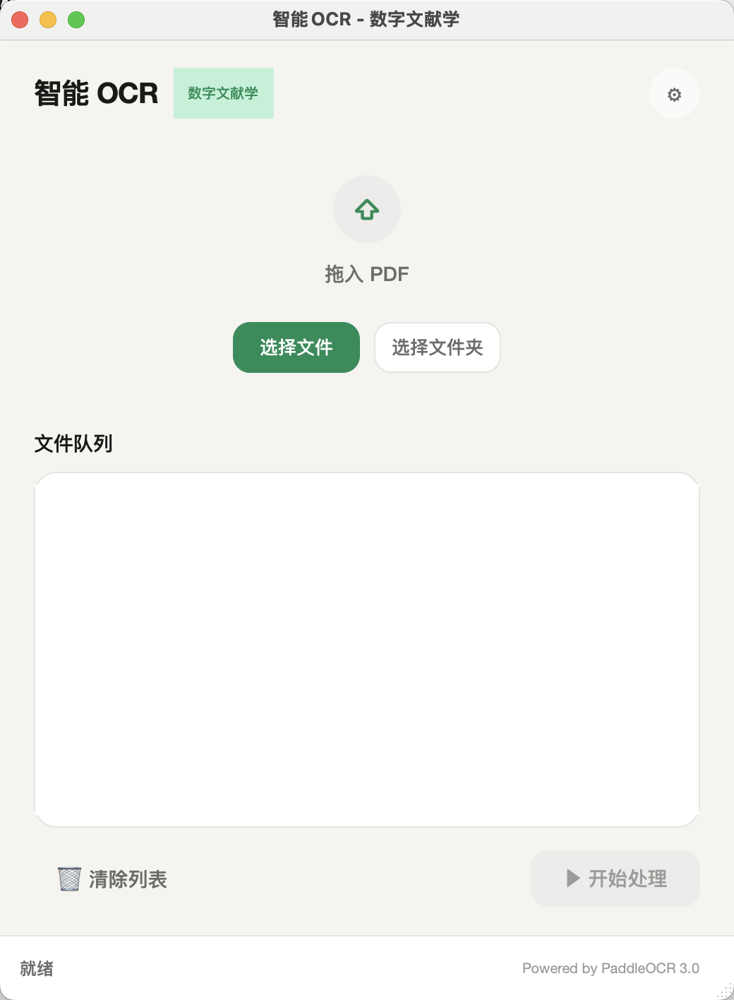
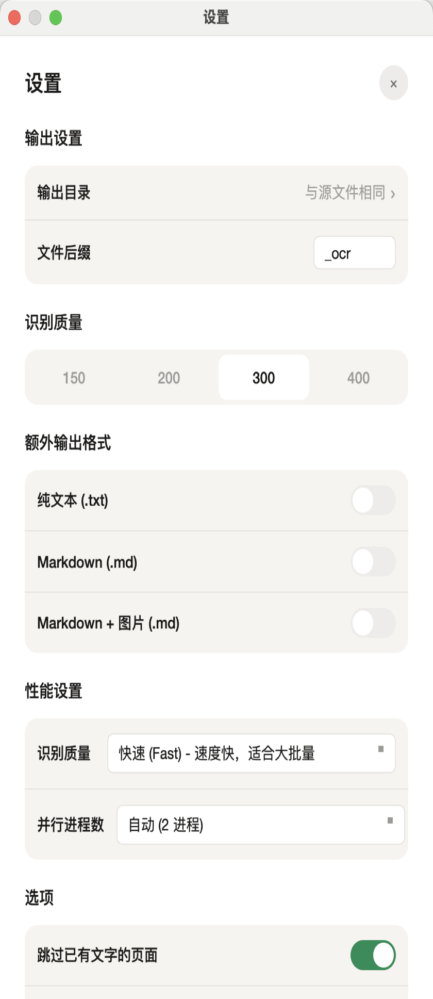

# 智能 OCR · 数字文献学

> 将扫描版 PDF 转为可全文搜索的 PDF，专为中文古籍与学术文献设计。

## ⬇️ 立即下载

| 平台 | 下载 |
|------|------|
| 🍎 macOS (Apple Silicon M1/M2/M3/M4) | [**智能OCR工具_macOS_arm64_v2.1.0.dmg**](https://github.com/anon-research-tools/intelligent-ocr/releases/download/v2.1.0/OCR._macOS_arm64_v2.1.0.dmg) |
| 🍎 macOS (Intel x86_64) | [**智能OCR工具_macOS_intel_v2.1.0.dmg**](https://github.com/anon-research-tools/intelligent-ocr/releases/download/v2.1.0/OCR._macOS_intel_v2.1.0.dmg) |
| 🪟 Windows 10/11 (64位) | [**智能OCR工具_安装程序_v2.1.0.exe**](https://github.com/anon-research-tools/intelligent-ocr/releases/download/v2.1.0/OCR._._v2.1.0.exe) |

👉 [查看所有版本](https://github.com/anon-research-tools/intelligent-ocr/releases)

> **首次启动**会自动下载 OCR 模型（约 200MB），需要联网。之后完全离线使用。

---

## 为什么选择这款工具？

| 功能 | 说明 |
|------|------|
| 🔍 **全文可搜索** | 扫描图像原样保留，同时写入隐藏文字层，支持选取、复制、全文搜索 |
| 🀄 **古籍繁体专项优化** | 内置 10,000+ 条异体字映射：搜索「大藏經」，写作「大蔵經」的页面也能命中 |
| 📁 **大批量稳定处理** | 拖拽整个文件夹批量入队，500 页以上大书不崩溃 |
| ⏸️ **断点续传** | 任意中断后重启，从上次位置继续，已完成页面不重复处理 |
| ✅ **页面完整性保护** | 处理完成后自动核验页数，缺页时自动从原文件补全并发出警告 |
| 🚀 **流水线加速** | 渲染与 OCR 并行，速度比串行快 30–40% |
| 📄 **多格式导出** | 可选同时导出 `.txt`（纯文字）和 `.md`（Markdown） |
| 💻 **完全本地运行** | 模型下载到本地后无需联网，文件不上传任何服务器 |

---

## 快速上手

1. 下载安装包，安装后启动「智能OCR工具」
2. 将 PDF 文件拖入窗口（或点击「选择文件」/「选择文件夹」）
3. 点击右下角「▶ 开始处理」
4. 完成后，输出文件与原文件同目录，文件名加 `_ocr` 后缀

macOS 首次打开若提示「无法验证开发者」：右键点击应用 → 打开 → 在弹窗中点击「打开」。

---

## 界面预览

<table>
  <tr>
    <td align="center"><b>主界面</b></td>
    <td align="center"><b>设置页面</b></td>
  </tr>
  <tr>
    <td></td>
    <td></td>
  </tr>
</table>

---

## 状态说明

| 状态 | 含义 |
|------|------|
| 灰色「待处理」 | 等待队列 |
| 蓝色「处理中」+ 进度条 | 正在 OCR |
| 绿色「已完成」 | 成功 |
| 绿色「已完成 ⚠」 | 成功，但有部分页面从原文件复制（悬停查看详情） |
| 红色「失败」 | 发生错误（悬停查看原因） |

---

## 设置选项

点击右上角 ⚙ 图标进入设置：

| 选项 | 说明 |
|------|------|
| 识别语言 | 中文 / 英文 / 日文（可多选） |
| 识别质量 | 快速 / 均衡 / 精准 |
| DPI | 渲染分辨率，300 DPI 为推荐值 |
| 并行线程数 | 多核加速，默认自动检测（建议 ≤2） |
| 跳过已有文字 | 跳过已含文字层的页面，避免重复处理 |
| 断点续传 | 开启后支持中断恢复 |
| 导出 TXT / Markdown | 同时导出纯文字或 Markdown 格式 |

---

## 命令行用法

```bash
# 处理单个文件（输出到同目录的 input_ocr.pdf）
./智能OCR工具 input.pdf
```

---

## 常见问题

**Q: 首次启动很慢？**
模型文件约 200MB，首次运行自动下载并缓存到本地，后续无需联网。

**Q: 处理速度多快？**
Apple M 系列芯片约 8–15 秒/页（均衡模式），Windows Intel 约 15–25 秒/页。

**Q: 支持多大的文件？**
无硬性限制。流水线分页处理，内存占用恒定；断点续传保障超长任务可靠完成。

**Q: 输出文件比原文件大？**
正常现象。输出包含原始图像层（保留画质）+ 文字层。可在设置中降低 DPI 减小体积。

**Q: 日志在哪？**
`~/.ocr_tool/logs/`（macOS）或 `%USERPROFILE%\.ocr_tool\logs\`（Windows）。
设置 `OCR_DEBUG=1` 环境变量可开启详细调试日志。

---

## 软件架构

```
ocr_tool/
├── core/                        # 平台无关的核心处理层
│   ├── ocr_engine.py            # PaddleOCR 封装，支持 fast/balanced/high 三种质量模式
│   ├── pdf_processor.py         # 主处理管道：流水线渲染、双层 PDF 合成、多格式导出
│   ├── checkpoint.py            # 断点续传：JSON 检查点，记录已完成/跳过/失败页面
│   ├── task_manager.py          # 任务队列，PENDING→PROCESSING→COMPLETED/FAILED
│   ├── parallel_ocr.py          # 多进程并行 OCR（spawn 模式，兼容 PaddlePaddle）
│   └── variants.py              # 异体字映射器，10,556 条规则
│
├── desktop/                     # PySide6 桌面 GUI 层（Apple 风格设计）
│   ├── main_window.py           # 主窗口，懒加载 OCR 模型（节省 ~500MB 启动内存）
│   ├── workers.py               # QThread 后台线程，发出 progress/task_complete 信号
│   ├── styles.py                # 集中样式管理
│   └── widgets/
│       ├── drop_zone.py         # 拖拽区域
│       ├── file_queue.py        # 文件队列（含警告状态 ⚠ 显示）
│       ├── settings_dialog.py   # 设置对话框
│       └── process_dialog.py    # 处理进度对话框
│
├── web/                         # FastAPI Web 服务（可选，用于服务器部署）
│   └── app.py                   # REST API: upload → status → download
│
├── hooks/                       # PyInstaller 打包钩子
│   └── rthook_paddlex_deps.py   # 修补 PaddleX 依赖检查，使其在 frozen 环境运行
│
├── installers/
│   ├── macos/build_dmg.sh       # macOS DMG 构建脚本
│   └── windows/setup.iss        # Inno Setup Windows 安装脚本
│
├── .github/workflows/build.yml  # GitHub Actions 自动构建（macOS + Windows）
├── variants.txt                 # 10,556 条异体字映射表
├── main.py                      # 入口：GUI 模式 / CLI 模式
└── ocr_tool.spec                # PyInstaller 打包配置
```

---

## 开发者指南

### 环境搭建

```bash
git clone https://github.com/anon-research-tools/intelligent-ocr.git
cd intelligent-ocr

python -m venv venv
source venv/bin/activate   # Windows: venv\Scripts\activate
pip install -r requirements-desktop.txt
```

### 运行与测试

```bash
python main.py                        # 图形界面
python main.py input.pdf              # 命令行处理单个文件
uvicorn web.app:app --port 8000       # Web 服务
python -m pytest tests/ -v            # 运行测试
```

### 发布新版本

推送 tag 即可触发 GitHub Actions 在 macOS 和 Windows 上自动构建并发布 Release：

```bash
git tag v2.1.0
git push origin v2.1.0
```

---

## 技术栈

- **OCR 引擎**: PaddleOCR v5 / PaddleX（PP-OCRv5 模型）
- **PDF 处理**: PyMuPDF (fitz)
- **桌面 GUI**: PySide6 (Qt6)
- **Web 框架**: FastAPI + Uvicorn
- **打包**: PyInstaller + create-dmg (macOS) / Inno Setup (Windows)

---

## 许可证

MIT License
